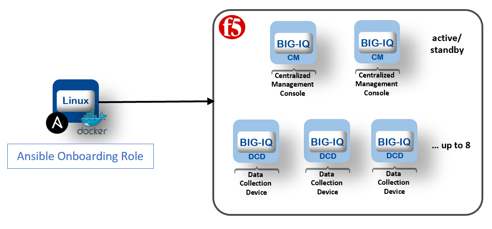

BIG-IQ Onboarding with Docker and Ansible
-----------------------------------------

Performs series of on-boarding steps to bootstrap a BIG-IQ system
to the point that it can accept configuration.

This can be used for **lab**, **proof of concept** or **production** BIG-IQ deployments.

Consult the [Planning and Implementing a BIG-IQ Centralized Management Deployment](https://techdocs.f5.com/kb/en-us/products/big-iq-centralized-mgmt/manuals/product/big-iq-centralized-management-plan-implement-deploy-6-1-0.html) for for details.



Once the inventory hosts file is set with the necessary information (IP, license, dns, ntp, ...), the Ansible playbooks can be launched from your local machine or a remote linux machine, as long as you have network connectivity to the management IP addresses of the targeted BIG-IQ instances to onboard/configure.

Instructions
------------

1. Choose the number of BIG-IQ and DCD you aim to deploy.

   **Examples**:
    - 1 BIG-IQ CM standalone, 1 BIG-IQ DCD
    - 1 BIG-IQ CM standalone, 2 BIG-IQ DCDs
    - 2 BIG-IQ CMs HA, 3 BIG-IQ DCDs

2. Deploy BIG-IQ instances in your environment.

    - [AWS](https://aws.amazon.com/marketplace/pp/B00KIZG6KA?qid=1495059228012&sr=0-1&ref_=srh_res_product_title)
    - [Azure](https://azuremarketplace.microsoft.com/en-us/marketplace/apps/f5-networks.f5-big-iq?tab=Overview)
    - [VMware](https://downloads.f5.com/esd/eula.sv?sw=BIG-IQ&pro=big-iq_CM&ver=6.1.0&container=v6.1.0&_ga=2.95373976.584487124.1557161462-1415455721.1549652512)
    - [Openstack](https://downloads.f5.com/esd/eula.sv?sw=BIG-IQ&pro=big-iq_CM&ver=6.1.0&container=v6.1.0&_ga=2.200814506.584487124.1557161462-1415455721.1549652512)
    - [HyperV](https://downloads.f5.com/esd/eula.sv?sw=BIG-IQ&pro=big-iq_CM&ver=6.1.0&container=v6.1.0&_ga=2.133130250.584487124.1557161462-1415455721.1549652512)

    Go to the [BIG-IQ Knowledge Center](https://support.f5.com/csp/knowledge-center/software/BIG-IQ?module=BIG-IQ%20Centralized%20Management&version=6.1.0) and follow the setup guide.

    Public Cloud deployments ([AWS](https://techdocs.f5.com/kb/en-us/products/big-iq-centralized-mgmt/manuals/product/big-iq-centralized-management-and-amazon-web-services-setup-6-0-0.html)/[Azure](https://techdocs.f5.com/kb/en-us/products/big-iq-centralized-mgmt/manuals/product/big-iq-centralized-management-and-msft-azure-setup-6-0-0.html)):

    - Deploy the instances with min 2 NICs
    - Create an EIP and assign it to the primary interfaces for each CM instances
    - Make sure you have the private key of the Key Pairs selected
    - Copy your private key in the under the f5-bigiq-onboarding directory and name it ``privatekey.pem``and apply correct permission ``chmod 600 privatekey.pem``
    - Configure the network security group for the ingress rules on each instances

      *Example for AWS: (172.16.0/24 = VPC subnet, sg-06b096098f4 = Security Group Name, 34.132.183.134/32 = [your public IP](https://www.whatismyip.com))*

      Ports | Protocol | Source 
      ----- | -------- | ------
      | 80  | tcp | 172.16.0/24 |
      | 443 | tcp | 172.16.0/24 |
      | 22 | tcp | 172.16.0/24 |
      | 0-65535 | tcp | sg-06b096098f4 |
      | All traffic | all | 34.132.183.134/32 |      
  
3. From a linux machine with access to the BIG-IQ instances.

    - Install [Docker](https://docs.docker.com/install/linux/docker-ce/ubuntu/) ([AWS](https://docs.aws.amazon.com/AmazonECS/latest/developerguide/docker-basics.html) or [Azure](https://docs.docker.com/docker-for-azure/))
    - Install [Git](https://git-scm.com/download/linux)

    Example for Amazon Linux EC2 instance:
    ```
    sudo yum update -y
    sudo amazon-linux-extras install docker -y
    sudo service docker start
    sudo yum install git -y
    ```

    Then, clone the repository:

    ```
    git clone https://github.com/f5devcentral/f5-big-iq-pm-team.git
    ```

4. Update the ansible inventory hosts file with the correct information (management IP, self IPs, license, master key, ...).

    ```
    cd f5-bigiq-onboarding
    vi hosts
    ```

    Notes:
    
    - It is not recommended to set ``discoveryip`` for deployment in AWS or Azure (the management IP address will be used automatically if not set).
    - ``ansible_host`` in AWS and Azure should be the private IP address assigned to eth0

5. Build the Ansible docker images containing the F5 Ansible Galaxy roles.

    ```
    sudo docker build . -t f5-bigiq-onboarding
    ```

6. Validate Docker and Ansible are working correctly.

    ```
    sudo docker run -t f5-bigiq-onboarding ansible-playbook --version
    ```

    Ansible version should be displayed.

7. Change default shell on all instances to bash, and set the admin's password (*AWS only*)

    ```
    ./ansible_helper ansible-playbook /ansible/bigiq_onboard_pretasks_aws.yml -i /ansible/hosts
    ```

8. Execute the BIG-IQ onboarding playbooks.

    ```
    ./ansible_helper ansible-playbook /ansible/bigiq_onboard.yml -i /ansible/hosts
    ```

9. Open BIG-IQ CM in a web browser by using the management private or public IP address with https, for example: ``https://<bigiq_mgt_ip>``.

10. If you have 2 BIG-IQ CMs, go to the [BIG-IQ Knowledge Center](https://techdocs.f5.com/kb/en-us/products/big-iq-centralized-mgmt/manuals/product/big-iq-centralized-management-plan-implement-deploy-6-1-0/04.html) to configure HA.

11. Verify connectivity between BIG-IQ CM, DCD and BIG-IPs.

    ```
    mkdir /shared/scripts
    cd /shared/scripts
    curl https://raw.githubusercontent.com/f5devcentral/f5-big-iq-pm-team/master/f5-bigiq-connectivityChecks/f5_network_connectivity_checks.sh > f5_network_connectivity_checks.sh
    chmod +x f5_network_connectivity_checks.sh
    ./f5_network_connectivity_checks.sh
    ```

12. [Determine how much space you need on each of the volumes your BIG-IQ system uses](https://techdocs.f5.com/kb/en-us/products/big-iq-centralized-mgmt/manuals/product/big-iq-centralized-management-dcd-sizing-guide-6-0-0/2.html) (*optional*)

13. [Resizing Disk Space on BIG-IQ Virtual Edition](https://techdocs.f5.com/kb/en-us/products/big-iq-centralized-mgmt/manuals/product/big-iq-centralized-management-dcd-sizing-guide-6-0-0/3.html) (*optional*)

14. Start managing BIG-IP devices from BIG-IQ, go to the [BIG-IQ Knowledge Center](https://techdocs.f5.com/kb/en-us/products/big-iq-centralized-mgmt/manuals/product/big-iq-centralized-management-device-6-1-0/02.html#concept-3571).

For more information, go to the [BIG-IQ Knowledge Center](https://support.f5.com/csp/knowledge-center/software/BIG-IQ?module=BIG-IQ%20Centralized%20Management&version=6.1.0).


Miscellaneous
-------------

- In case you need to restore the BIG-IQ system to factory default settings, follow [K15886](https://support.f5.com/csp/article/K15886) article.

- Disable SSL authentication for SSG (**LAB/POC only**):

  ```
  echo >> /var/config/orchestrator/orchestrator.conf
  echo 'VALIDATE_CERTS = "no"' >> /var/config/orchestrator/orchestrator.conf
  bigstart restart gunicorn
  ```

Troubleshooting
---------------

n/a

### Copyright

Copyright 2014-2019 F5 Networks Inc.

### License

#### Apache V2.0

Licensed under the Apache License, Version 2.0 (the "License"); you may not use
this file except in compliance with the License. You may obtain a copy of the
License at

http://www.apache.org/licenses/LICENSE-2.0

Unless required by applicable law or agreed to in writing, software
distributed under the License is distributed on an "AS IS" BASIS,
WITHOUT WARRANTIES OR CONDITIONS OF ANY KIND, either express or implied.
See the License for the specific language governing permissions and limitations
under the License.

#### Contributor License Agreement

Individuals or business entities who contribute to this project must have
completed and submitted the [F5 Contributor License Agreement](http://f5-openstack-docs.readthedocs.io/en/latest/cla_landing.html).