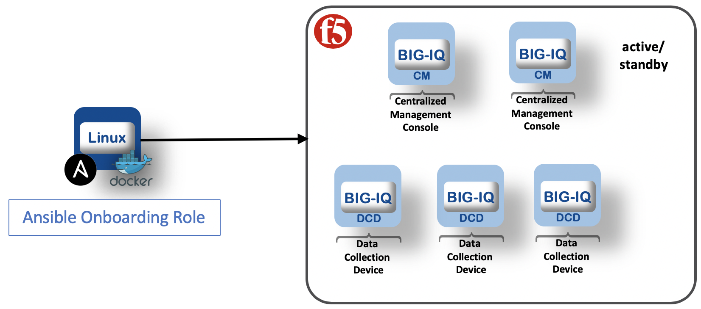

BIG-IQ Onboarding with Docker and Ansible
-----------------------------------------

Performs series of on-boarding steps to bootstrap a BIG-IQ system
to the point that it can accept configuration.

This can be used for **lab**, **proof of concept** or **production** BIG-IQ deployments.

Consult the [Planning and Implementing a BIG-IQ Centralized Management Deployment](https://techdocs.f5.com/en-us/bigiq-7-0-0/planning-and-implementing-big-iq-deployment.html) for details.



Once the inventory hosts file is set with the necessary information (IP, license, dns, ntp, ...), the Ansible playbooks can be launched from your local machine or a remote linux machine, as long as you have network connectivity to the management IP addresses of the targeted BIG-IQ instances to onboard/configure.

Instructions
------------

1. Choose the number of BIG-IQ CM and DCD you aim to deploy.

   **Examples**:
    - 1 BIG-IQ CM standalone, 1 BIG-IQ DCD
    - 1 BIG-IQ CM standalone, 2 BIG-IQ DCDs
    - 2 BIG-IQ CMs HA, 3 BIG-IQ DCDs

2. Deploy BIG-IQ instances in your environment.

    - [AWS](https://aws.amazon.com/marketplace/pp/B00KIZG6KA?qid=1495059228012&sr=0-1&ref_=srh_res_product_title)
    - [Azure](https://azuremarketplace.microsoft.com/en-us/marketplace/apps/f5-networks.f5-big-iq?tab=Overview)
    - [VMware](https://downloads.f5.com/esd/product.jsp?sw=BIG-IQ&pro=big-iq_CM)
    - [Openstack](https://downloads.f5.com/esd/product.jsp?sw=BIG-IQ&pro=big-iq_CM)
    - [HyperV](https://downloads.f5.com/esd/product.jsp?sw=BIG-IQ&pro=big-iq_CM)

    Go to the [BIG-IQ Knowledge Center](https://support.f5.com/csp/knowledge-center/software/BIG-IQ?module=BIG-IQ%20Centralized%20Management&version=7.0.0) and follow the setup guide.

    Public Cloud deployments ([AWS](https://techdocs.f5.com/kb/en-us/products/big-iq-centralized-mgmt/manuals/product/big-iq-centralized-management-and-amazon-web-services-setup-6-0-0.html)/[Azure](https://techdocs.f5.com/kb/en-us/products/big-iq-centralized-mgmt/manuals/product/big-iq-centralized-management-and-msft-azure-setup-6-0-0.html)):

    - Deploy the instances with min 2 NICs (**REQUIRED** even if you are not using the 2nd Network Interface)
    - m4.2xlarge (AWS) and Standard_D8_v3 (Azure) are instance type recommended
    - Create EIPs and assign them to the primary interfaces for each CM and DCD instances
    - Make sure you have the private key of the Key Pairs selected
    - Copy your private key in the under the ~/.ssh directory and apply correct permission chmod 600 privatekey.pem in your linux machine you will use to run the tool
    - Configure the network security group for the ingress rules on each instances
    - Wait approximately 6 minutes before logging in

      *Example for AWS: (10.192.75.0/24 = VPC subnet, 34.132.183.134/32 = [your public IP](https://www.whatismyip.com))*

      Ports | Protocol | Source 
      ----- | -------- | ------
      | 0-65535 | tcp | 10.192.75.0/24 |
      | All traffic | all | 34.132.183.134/32 |      
  
3. From a linux machine with access to the BIG-IQ instances.

    - Install [Docker](https://docs.docker.com/install/linux/docker-ce/ubuntu/) ([AWS](https://docs.aws.amazon.com/AmazonECS/latest/developerguide/docker-basics.html) or [Azure](https://docs.docker.com/docker-for-azure/))
    - Install [Git](https://git-scm.com/download/linux)

    Example for Amazon Linux EC2 instance:
    ```
    sudo yum update -y
    sudo amazon-linux-extras install docker -y
    sudo service docker start
    sudo yum install git -y
    ```

    Then, clone the repository:

    ```
    git clone https://github.com/f5devcentral/f5-big-iq-onboarding.git
    ```

4. Update the ansible inventory hosts file with the correct information (management IP, self IPs, license, master key, ...).

    ```
    cd f5-big-iq-onboarding
    vi hosts
    ```

    Notes:
    
    - It is not recommended to set ``discoveryip`` for deployment in AWS or Azure (the management IP address will be used automatically if not set). The 2nd NIC won't be used in this case.
    - ``ansible_host`` in AWS and Azure should be the private IP address assigned to eth0 (**DO NOT** use the public IP).
     - When setting up BIG-IQ HA, the host with haprimary=False needs to be the first listed.

5. Build the Ansible docker images containing the F5 Ansible Galaxy roles.

    ```
    sudo docker build -t f5-big-iq-onboarding .
    ```

6. Validate Docker and Ansible are working correctly.

    ```
    sudo docker run -t f5-big-iq-onboarding ansible-playbook --version
    ```

    Ansible version should be displayed.

7. Change default shell on **ALL instances** to bash, and set the admin's password to admin (*AWS only*).
   SSH to each instances and run these tmsh commands (replace the IP addresses with the eth0 internal IP addresses of each instances):

    ```
    declare -a ips=("10.1.1.27" "10.1.1.20")
    newpassword="admin"
    privkey="~/.ssh/privatekey.pem"
    for h in "${ips[@]}"
    do
        ssh -o StrictHostKeyChecking=no -i $privkey admin@$h modify auth user admin password $newpassword
        ssh -o StrictHostKeyChecking=no -i $privkey admin@$h modify auth user admin shell bash
        ssh -o StrictHostKeyChecking=no -i $privkey admin@$h tmsh save sys config
    done
    ```

8. Execute the BIG-IQ onboarding playbooks.

    ```
    ./ansible_helper ansible-playbook /ansible/bigiq_onboard.yml -i /ansible/hosts
    ```

9. Open BIG-IQ CM in a web browser by using the management private or public IP address with https, for example: ``https://<bigiq_mgt_ip>``.

10. Change admin and root default password on all instances, follow [K16275](https://support.f5.com/csp/article/K16275) article.

11. If you have 2 BIG-IQ CMs, go to the BIG-IQ Knowledge Center [for 6.1 and below](https://techdocs.f5.com/kb/en-us/products/big-iq-centralized-mgmt/manuals/product/big-iq-centralized-management-plan-implement-deploy-6-1-0/04.html) or [for 7.0 and after](https://techdocs.f5.com/en-us/bigiq-7-0-0/creating-a-big-iq-high-availability-auto-fail-over-config.html) to configure HA.

12. Verify connectivity between BIG-IQ CM, DCD and BIG-IPs. SSH to the BIG-IQ CM primary and execute.

    ```
    mkdir /shared/scripts
    cd /shared/scripts
    curl https://raw.githubusercontent.com/f5devcentral/f5-big-iq-pm-team/master/f5-bigiq-connectivityChecks/f5_network_connectivity_checks.sh > f5_network_connectivity_checks.sh
    chmod +x f5_network_connectivity_checks.sh
    ./f5_network_connectivity_checks.sh
    ```

    Note: Default user will be root but you can use different one (e.g. admin), in this case run: ``./f5_network_connectivity_checks.sh admin admin``

13. [Determine how much space you need on each of the volumes your BIG-IQ system uses](https://techdocs.f5.com/en-us/bigiq-7-0-0/big-iq-dcd-sizing/prerequisites.html) (*optional*)

14. [Resizing Disk Space on BIG-IQ Virtual Edition](https://techdocs.f5.com/en-us/bigiq-7-0-0/big-iq-dcd-sizing/resizing-disk-space-on-big-iq-virtual-edition.html) (*optional*)

15. Start managing BIG-IP devices from BIG-IQ, go to the [BIG-IQ Knowledge Center](https://techdocs.f5.com/en-us/bigiq-7-0-0/managing-big-ip-devices-from-big-iq/device-discovery-and-basic-management.html).

For more information, go to the [BIG-IQ Knowledge Center](https://support.f5.com/csp/knowledge-center/software/BIG-IQ?module=BIG-IQ%20Centralized%20Management&version=7.0.0).


Miscellaneous
-------------

- In case you need to restore the BIG-IQ system to factory default settings, follow [K15886](https://support.f5.com/csp/article/K15886) article.

- Disable SSL authentication for SSG or VE creation in VMware (**LAB/POC only**):

  ```
  echo >> /var/config/orchestrator/orchestrator.conf
  echo 'VALIDATE_CERTS = "no"' >> /var/config/orchestrator/orchestrator.conf
  bigstart restart gunicorn
  bigstart restart restjavad
  ```

  *Note: This parameter added to the orchestrator.conf is NOT preserves during BIG-IQ upgrade.*

Troubleshooting
---------------

1. If you want to know what is happening when a Playbook runs, provide the **-vvvv** argument to the ansible-playbook command.

    ```
    ./ansible_helper ansible-playbook /ansible/bigiq_onboard.yml -i /ansible/hosts -vvvv
    ```

2. If you get the error *"Failed to license the device"*, make sure your BIG-IQ instances have access to the F5 license server (Internet).

3. Below error can be ignored.

    ```
    TASK [bigiq_onboard : Test authentication - old or new credentials] ****************************************************************************************************************
    fatal: [bigiq-dcd-1.lab.local]: FAILED! => {"cache_control": "no-store, no-cache, must-revalidate", "changed": false, "connection": "close", "content": "{\"code\":401,\"message\":\"Authentication failed.\",\"originalRequestBody\":\"{\\\"username\\\":\\\"admin\\\", ...hn/login"}
    ...ignoring
    ```

### Copyright

Copyright 2020 F5 Networks Inc.

### License

#### Apache V2.0

Licensed under the Apache License, Version 2.0 (the "License"); you may not use
this file except in compliance with the License. You may obtain a copy of the
License at

http://www.apache.org/licenses/LICENSE-2.0

Unless required by applicable law or agreed to in writing, software
distributed under the License is distributed on an "AS IS" BASIS,
WITHOUT WARRANTIES OR CONDITIONS OF ANY KIND, either express or implied.
See the License for the specific language governing permissions and limitations
under the License.

#### Contributor License Agreement

Individuals or business entities who contribute to this project must have
completed and submitted the [F5 Contributor License Agreement](http://f5-openstack-docs.readthedocs.io/en/latest/cla_landing.html).
